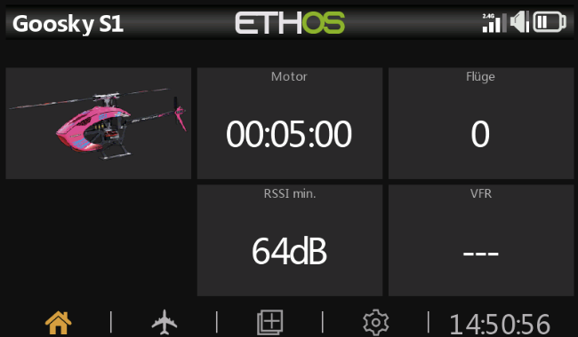
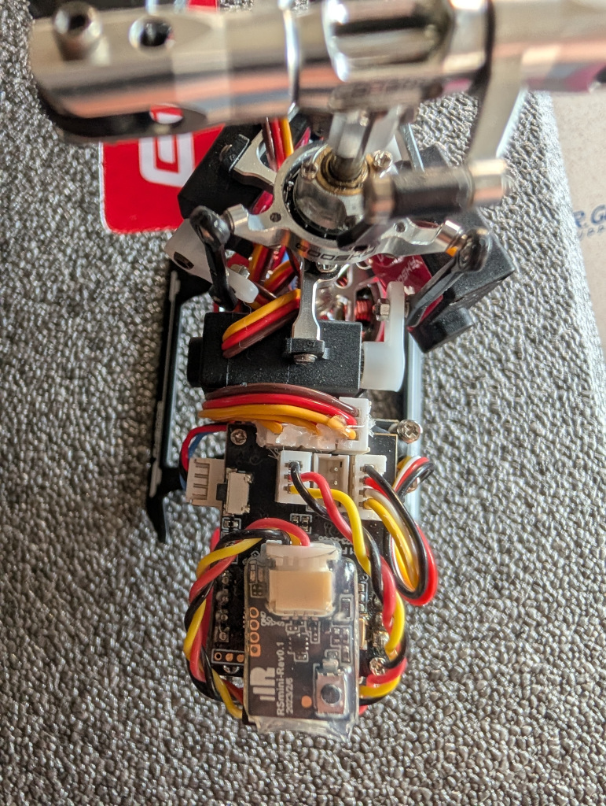
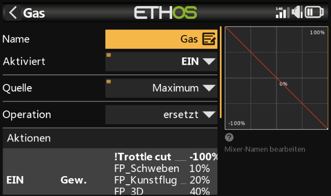
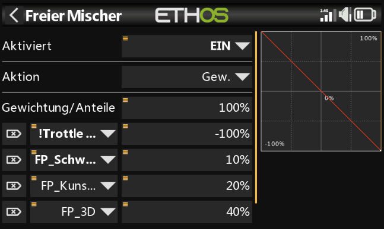
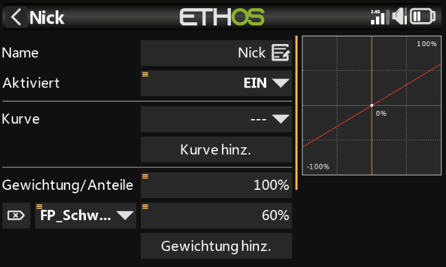

# Goosky S1 - Ethos Setup

**[🇩🇪 Deutsch]**
Ein Setup für den Goosky S1.  
**Besonderheit:** Keine Flugphasen erforderlich. Drehzahl **und** reduzierte Drehrate im Schweben werden direkt über Gewichte in den Mischern gesetzt.

**Features:**
* ✅ **Smart Flight Counter:** Zählt Flüge nur, wenn Motor AN ist **UND** eine Verbindung zum Heli besteht (RSSI > 35dB).
* ✅ **Direkte Headspeed-Einstellung:** Drehzahlwerte werden direkt im Mischer definiert.
* ✅ **Schwebe-Rate über Mischer:** Roll/Nick werden im Schweben per Gewichtung reduziert.
* ✅ **Double Safety:** Motor-Sicherung verknüpft zwei Schalterpositionen.

---

**[🇬🇧 English]**
An setup for the Goosky S1.  
**Special Feature:** No flight modes required. Head speed **and** reduced hover cyclic rate are configured directly via mixer weights.

**Features:**
* ✅ **Smart Flight Counter:** Only counts flights when Motor is ON **AND** connection is active (RSSI > 35dB).
* ✅ **Direct head speed setup:** RPM levels are configured directly in the mixer.
* ✅ **Hover rate via mixer:** Roll/Pitch are reduced in hover using mixer weighting.
* ✅ **Double Safety:** Throttle cut logic links two switch positions.

---

## 🛠 Voraussetzungen & Verkabelung / Requirements & Wiring

Damit dieses Setup funktioniert, wird folgende Hardware empfohlen:  
To make this setup work, the following hardware is recommended:

### Empfänger / Receiver
* **Modell:** FrSky **Archer Plus RS Mini** (oder vergleichbarer kleiner S.BUS Empfänger).
* **Protokoll:** ACCESS oder ACCST D16.
* **Verbindung:** S.BUS Port am Empfänger -> S.BUS Port am Goosky Flight Controller.

### Verkabelung / Wiring Diagram
Bitte achte auf die korrekte Polung am Flight Controller!  
Für den SBUS-Anschluss wird das blaue Kabel vom Archer nicht benötigt und kann somit entfernt werden.  
Please pay attention to the correct polarity on the flight controller!  
The blue cable from the Archer is not required for the SBUS connection and can therefore be removed.  

> **Hinweis:** Der Archer Plus RS Mini ist klein genug, um direkt im Rahmen des S1 Platz zu finden.  
> **Note:** The Archer Plus RS Mini is small enough to fit directly inside the S1 frame.

---

## 🖼 Modellbild-Farben / Model Bitmap Colors

Im Ordner `bitmaps/models` liegen drei vorbereitete Modellbilder, passend zur Heli-Farbe.  
The folder `bitmaps/models` contains three prepared model bitmaps matching helicopter colors.

* `Goosky S1g.bmp` -> Grün / Green
* `Goosky S1p.bmp` -> Pink
* `Goosky S1w.bmp` -> Weiß / White

In Ethos kannst du das gewünschte Bild im Modell als Modellbild auswählen.  
In Ethos, select the desired file as the model image for your model.

---

## 🛠 Drehzahl direkt im Mischer / Head Speed Directly in Mixers

Die Drehzahl wird jetzt vollständig in **Modell -> Mischer -> Gas (CH3)** gesetzt.  
Head speed is now configured entirely in **Model -> Mixers -> Throttle (CH3)**.

### Gas-Mischer (CH3)
* **Quelle / Source:** `Maximum`
* **Operation:** `ersetzt` / `replace`
* **Typ / Type:** Freier Mischer / Free Mixer

### Freier Mischer (Aktion -> Gewicht)
* `!Trottle cut` -> `-100%`
* `FP_Schweben` -> `10%`
* `FP_Kunstflug` -> `20%`
* `FP_3D` -> `40%`
* `sonst` -> `100%`

Damit legst du jede Drehzahlstufe direkt über das jeweilige Aktionsgewicht fest.  
This sets each head speed level directly via the corresponding action weight.

## 🛠 Reduzierte Drehrate im Schweben über Mischer / Reduced Hover Rate via Mixers

Auch Roll und Nick werden über Gewichtungen im Mischer reduziert, statt über Flugphasen.  
Roll and Pitch are also reduced using mixer weights instead of flight modes.

### Roll/Nick-Mischer (CH1/CH2)
* **Basisgewicht / Base Weight:** `100%`
* **Zusatzgewicht für Schweben / Hover Weight:** Aktion `FP_Schweben` auf `60%`

Damit sind Roll/Nick im Schweben reduziert, außerhalb davon laufen sie mit vollem Ausschlag.  
This reduces Roll/Pitch in hover, while keeping full throw outside hover.

### Screenshots (neue Mischer-Ansicht)
* Mischer-Übersicht mit `Gas` auf Kanal 3
* Detailansicht `Gas` (Quelle `Maximum`, Operation `ersetzt`)
* Aktionsliste im Gas-Mischer mit Gewichten
* Freier Mischer mit den einzelnen Einträgen (`!Trottle cut`, `FP_*`, `sonst`)
* Roll-Mischer mit reduzierter Schwebe-Gewichtung (`FP_Schweben = 60%`)
* Nick-Mischer mit reduzierter Schwebe-Gewichtung (`FP_Schweben = 60%`)

---

## 🧠 Die Logik im Detail / Logic Deep Dive

Hier ist eine Erklärung der vorprogrammierten Logik, falls du verstehen willst, wie das System arbeitet.  
Here is an explanation of the pre-programmed logic if you want to understand how the system works.

### 1. Drehzahl-Logik im Gas-Mischer (CH3)
Der Gas-Kanal nutzt einen freien Mischer mit Gewichten je Aktion.
* `-100%` für `!Trottle cut` schaltet den Motor sicher ab.
* Positive Gewichte (`10/20/40/100%`) definieren die jeweiligen Drehzahlstufen.
* Änderungen erfolgen direkt im Mixer, nicht über Flugphasen.

### 2. Schwebe-Rate-Logik für Roll/Nick (CH1/CH2)
Roll und Nick nutzen je einen zusätzlichen Gewichtungseintrag.
* Basis ist `100%`.
* Bei aktiver Aktion `FP_Schweben` wird auf `60%` reduziert.

### 3. Sicherheits-Logik (Safety)
`Throttle cut` hat immer Vorrang und erzwingt `-100%` auf Kanal 3.

### 4. Intelligenter Flugzähler (Smart Counter)
Der Zähler ist extrem präzise. Er erhöht den Wert "Flüge" nur, wenn:
1.  Motor aktiv ist.
2.  **UND** Link aktiv ist (RSSI > 35dB).
3.  **Der Motor mindestens 30s läuft.**

* Das verhindert, dass Tests auf der Werkbank (ohne eingeschalteten Heli) den Zähler hochtreiben.
* Realisiert über einen "Berechneten Sensor", der die Variable `VAR1` nutzt.

---

## 📡 Kanalbelegung / Channel Mapping

| CH | Funktion | Mischer Name | Details |
| :--- | :--- | :--- | :--- |
| **1** | Roll | Roll | Basis `100%`, bei `FP_Schweben` Gewichtung `60%` |
| **2** | Nick | Nick | Basis `100%`, bei `FP_Schweben` Gewichtung `60%` |
| **3** | Gas / Throttle | Gas | Quelle `Maximum`, Gewicht je Aktion (`-100/10/20/40/100%`) |
| **4** | Heck / Rudder | Heck | Standard 100% |
| **5** | Rettung / Rescue | Rettung | Schaltet Rettungsfunktion auf +100% |
| **6** | Pitch | Pitch | Linear -100 bis +100 |

---

## 🎵 Spezialfunktionen (Audio)

Folgende Ansagen sind vorkonfiguriert:
* **Motor:** Motor An / Motor Aus.
* **Rescue:** Stabilize/Rettung Ansage.
* **Optional:** Ansagen für die Drehzahlstufen entsprechend deiner Aktionen.
* *Hinweis:* Stelle sicher, dass du entsprechende Sounddateien auf deiner SD-Karte hast, oder weise sie neu zu.

---

## ⚠️ Wichtige Hinweise / Important Notes

**[🇩🇪]**
* **Mischer-Gewichte:** Passe die Gewichte im Gas-Mischer (`10/20/40/100%`) an deine gewünschte Kopfdrehzahl an.
* **Schwebe-Drehrate:** Passe bei Bedarf die Roll/Nick-Gewichtung für `FP_Schweben` (`60%`) an.
* **Rettung:** Prüfe am Boden trocken, ob bei Betätigung von `SF` (oder deinem gewählten Schalter) der Kanal 5 ausschlägt.

**[🇬🇧]**
* **Mixer Weights:** Adjust the throttle mixer weights (`10/20/40/100%`) to match your target head speeds.
* **Hover Cyclic Rate:** Adjust the Roll/Pitch hover weighting for `FP_Schweben` (`60%`) if needed.
* **Rescue:** Dry test on the ground to ensure Channel 5 responds when `SF` (or your chosen switch) is activated.