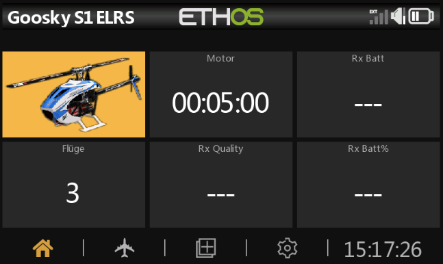
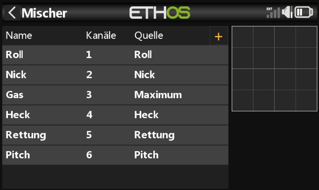
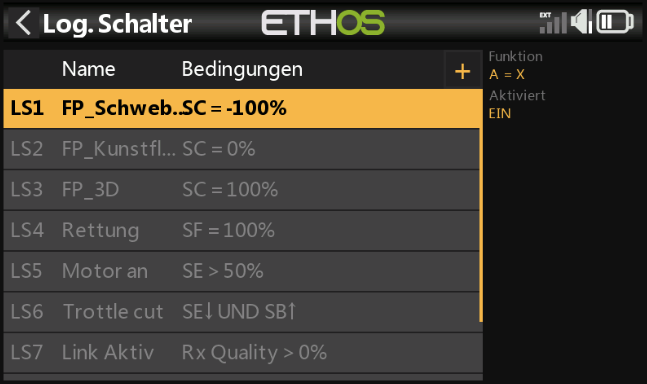
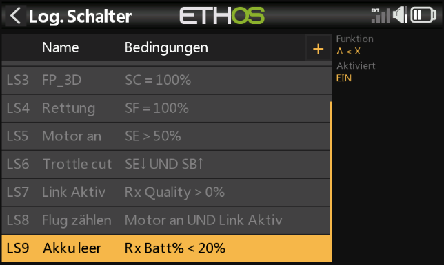
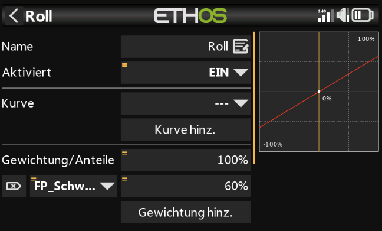

# Goosky S1 - Ethos Setup (V2 ELRS)

**[🇩🇪 Deutsch]**  
Setup für den Goosky S1 in der **V2 ELRS** Variante.

**Features:**
* ✅ ELRS-Setup für Ethos mit externem Funkmodul
* ✅ Empfänger-Setup mit BetaFPV Nano (oder kompatiblen ELRS-Empfängern)
* ✅ Wichtige ELRS-Linkparameter dokumentiert (z. B. 333Hz, 1:8)
* ✅ Drei Modellbild-Farben vorbereitet
* ✅ Screenshot-Sammlung im `doc`-Ordner eingebunden

---

**[🇬🇧 English]**  
Setup for the Goosky S1 **V2 ELRS** variant.

**Features:**
* ✅ ELRS setup for Ethos with external RF module
* ✅ Receiver setup with BetaFPV Nano (or any compatible ELRS receiver)
* ✅ Critical ELRS link parameters documented (e.g. 333Hz, 1:8)
* ✅ Three model bitmap colors prepared
* ✅ Screenshot gallery from the `doc` folder

---

## 🛠 Voraussetzungen / Requirements

### Sender / Radio
* **Ethos-Fernsteuerung:** Für ELRS muss ein **externes ELRS Funkmodul** verwendet werden.
* **Ethos radio:** For ELRS operation, an **external ELRS RF module** is required.

### Empfänger / Receiver
* In dieser Anleitung wird ein kleiner **BetaFPV Nano ELRS** Empfänger verwendet.
* Es kann aber auch jeder andere kompatible ELRS-Empfänger genutzt werden.
* This guide uses a small **BetaFPV Nano ELRS** receiver.
* Any other compatible ELRS receiver can be used as well.

---

## 📶 ELRS Hinweise / ELRS Notes

### Bindung / Binding
* Diese Anleitung beschreibt **nicht** den Bind-Vorgang.
* This guide does **not** cover the binding process.

### Link-Einstellungen / Link Settings
Für eine stabile Verbindung müssen Sender und Empfänger identisch konfiguriert sein.  
For a stable link, transmitter and receiver settings must match.

* **Paketrate / Packet Rate:** z. B. `333Hz`
* **Verhältnis / Telemetry Ratio:** z. B. `1:8`
* Beide Werte müssen auf Sender **und** Empfänger übereinstimmen.
* Both values must match on transmitter **and** receiver.

---

## 🖼 Modellbild-Farben / Model Bitmap Colors

Im Ordner `bitmaps/models` liegen drei vorbereitete Modellbilder für unterschiedliche Farbvarianten.  
The folder `bitmaps/models` contains three prepared model bitmaps for different color variants.

* `GooslyS1-2b.bmp` -> Blau / Blue
* `GooslyS1-2o.bmp` -> Orange
* `GooslyS1-2p.bmp` -> Pink

In Ethos kannst du das gewünschte Bild als Modellbild auswählen.  
In Ethos, select the desired file as model image.

---

## 🎵 Audio-Struktur / Audio Structure

Vorhandene Struktur:
* `audio/de/default`
* `audio/en/default`

Lege hier deine Sprachansagen für Schalterzustände, Motorstatus und Rettung ab.  
Place voice prompts for switch states, motor status, and rescue here.

---

## 📡 Kanalbelegung / Channel Mapping

Die Mischerbelegung im Modell ist wie folgt aufgebaut:  
The mixer channel mapping in this model is set up as follows:

| CH | Funktion | Quelle |
| :--- | :--- | :--- |
| **1** | Roll | Roll |
| **2** | Nick | Nick |
| **3** | Gas / Throttle | Maximum |
| **4** | Heck / Rudder | Heck |
| **5** | Rettung / Rescue | Rettung |
| **6** | Pitch | Pitch |

---

## ⚙️ Gaswerte einstellen / Adjusting Throttle Values

Die Gaswerte werden direkt im Mischer auf **Kanal 3 (Gas)** über die Gewichtungen pro Aktion gesetzt.  
Throttle values are set directly in the **Channel 3 (Throttle)** mixer via action weights.

### Vorgehen / Procedure
* Öffne **Modell -> Mischer -> Gas (CH3)**.
* Setze **Quelle / Source** auf `Maximum`.
* Nutze einen freien Mischer und hinterlege die gewünschten Gewichte pro Aktion.
* Passe die Prozentwerte der einzelnen Aktionen an die gewünschte Kopfdrehzahl an.

Damit kannst du deine Headspeed-Stufen schnell anpassen, ohne die Kanalstruktur zu ändern.  
This lets you tune head speed levels quickly without changing channel structure.

---

## 🖼 Screenshots / Screenshots

Dokumentierte Ansichten aus dem `doc`-Ordner:  
Documented views from the `doc` folder:

---

## ⚠️ Hinweise / Notes

* Prüfe nach jedem Modellimport die ELRS-Linkparameter auf beiden Seiten (Sender/Empfänger).
* Übernimm die Mischerwerte immer 1:1 aus dem finalen Modellstand.
